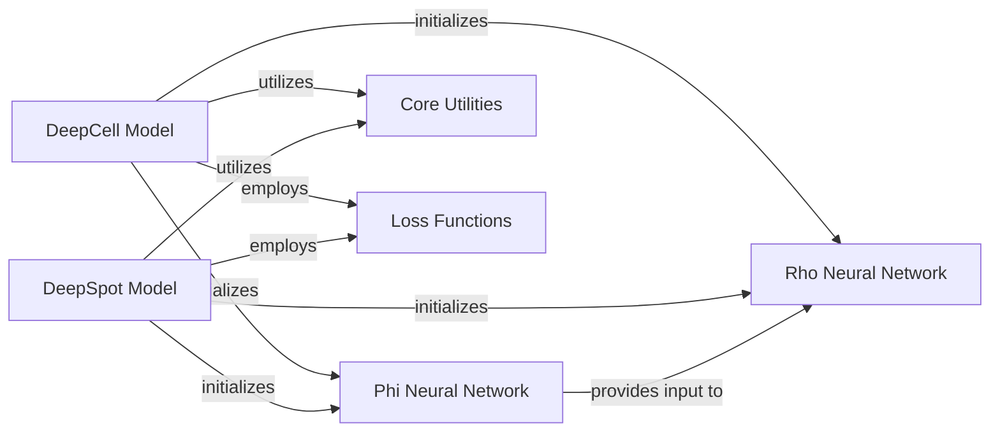

## Component Details

The system focuses on analyzing cell and spot-level data using deep learning models. It comprises two main model types, DeepCell Model and DeepSpot Model, each designed for specific data granularities. These models leverage shared Phi Neural Network and Rho Neural Network components for feature transformation and final output generation. A variety of Loss Functions are employed to guide model training, and Core Utilities provide essential helper functionalities like reproducibility. The system's primary purpose is to process and analyze biological data at different spatial resolutions, enabling insights into cellular and molecular patterns.

### DeepCell Model
The DeepCell Model is a core component for analyzing cell-level data. It is responsible for initializing the neural network architecture, including Phi and Rho modules, configuring the loss function, and defining the forward pass logic based on the specified cell context (e.g., individual cell or cell with neighbors). It also manages training and validation steps, loss tracking, and optimization.

**Related Classes/Methods**:

- <a href="https://github.com/ratschlab/DeepSpot/blob/master/deepspot/cell/model.py#L63-L281" target="_blank" rel="noopener noreferrer">`DeepSpot.deepspot.cell.model.DeepCell` (63:281)</a>
- <a href="https://github.com/ratschlab/DeepSpot/blob/master/deepspot/cell/model.py#L130-L135" target="_blank" rel="noopener noreferrer">`DeepSpot.deepspot.cell.model.DeepCell._get_phi_multiplier` (130:135)</a>
- <a href="https://github.com/ratschlab/DeepSpot/blob/master/deepspot/cell/model.py#L137-L142" target="_blank" rel="noopener noreferrer">`DeepSpot.deepspot.cell.model.DeepCell._get_forward_function` (137:142)</a>
- <a href="https://github.com/ratschlab/DeepSpot/blob/master/deepspot/cell/model.py#L190-L209" target="_blank" rel="noopener noreferrer">`DeepSpot.deepspot.cell.model.DeepCell._apply_phi` (190:209)</a>
- <a href="https://github.com/ratschlab/DeepSpot/blob/master/deepspot/cell/model.py#L211-L214" target="_blank" rel="noopener noreferrer">`DeepSpot.deepspot.cell.model.DeepCell._apply_rho` (211:214)</a>
- <a href="https://github.com/ratschlab/DeepSpot/blob/master/deepspot/cell/model.py#L179-L181" target="_blank" rel="noopener noreferrer">`DeepSpot.deepspot.cell.model.DeepCell._forward_cell` (179:181)</a>
- <a href="https://github.com/ratschlab/DeepSpot/blob/master/deepspot/cell/model.py#L183-L188" target="_blank" rel="noopener noreferrer">`DeepSpot.deepspot.cell.model.DeepCell._forward_cell_neighbors` (183:188)</a>

### DeepSpot Model
The DeepSpot Model is the central component for analyzing spot-level data, analogous to the DeepCell Model but tailored for spatial transcriptomics spots. It handles the initialization of its own Phi and Rho modules, selection of the appropriate loss function, and execution of the forward pass based on various spot contexts (e.g., individual spot, spot with subspot, spot with neighbors). It also manages the training and validation lifecycle.

**Related Classes/Methods**:

- <a href="https://github.com/ratschlab/DeepSpot/blob/master/deepspot/spot/model.py#L58-L217" target="_blank" rel="noopener noreferrer">`DeepSpot.deepspot.spot.model.DeepSpot` (58:217)</a>
- <a href="https://github.com/ratschlab/DeepSpot/blob/master/deepspot/spot/model.py#L110-L117" target="_blank" rel="noopener noreferrer">`DeepSpot.deepspot.spot.model.DeepSpot._get_phi_multiplier` (110:117)</a>
- <a href="https://github.com/ratschlab/DeepSpot/blob/master/deepspot/spot/model.py#L119-L126" target="_blank" rel="noopener noreferrer">`DeepSpot.deepspot.spot.model.DeepSpot._get_forward_function` (119:126)</a>
- <a href="https://github.com/ratschlab/DeepSpot/blob/master/deepspot/spot/model.py#L189-L208" target="_blank" rel="noopener noreferrer">`DeepSpot.deepspot.spot.model.DeepSpot._apply_phi` (189:208)</a>
- <a href="https://github.com/ratschlab/DeepSpot/blob/master/deepspot/spot/model.py#L210-L213" target="_blank" rel="noopener noreferrer">`DeepSpot.deepspot.spot.model.DeepSpot._apply_rho` (210:213)</a>
- <a href="https://github.com/ratschlab/DeepSpot/blob/master/deepspot/spot/model.py#L163-L165" target="_blank" rel="noopener noreferrer">`DeepSpot.deepspot.spot.model.DeepSpot._forward_spot` (163:165)</a>
- <a href="https://github.com/ratschlab/DeepSpot/blob/master/deepspot/spot/model.py#L167-L172" target="_blank" rel="noopener noreferrer">`DeepSpot.deepspot.spot.model.DeepSpot._forward_spot_subspot` (167:172)</a>
- <a href="https://github.com/ratschlab/DeepSpot/blob/master/deepspot/spot/model.py#L174-L179" target="_blank" rel="noopener noreferrer">`DeepSpot.deepspot.spot.model.DeepSpot._forward_spot_neighbors` (174:179)</a>
- <a href="https://github.com/ratschlab/DeepSpot/blob/master/deepspot/spot/model.py#L181-L187" target="_blank" rel="noopener noreferrer">`DeepSpot.deepspot.spot.model.DeepSpot._forward_spot_subspot_neighbors` (181:187)</a>

### Phi Neural Network
The Phi Neural Network is a fundamental building block within both DeepCell and DeepSpot models. It serves as the initial feature transformation layer, typically consisting of a linear layer, dropout, and ReLU activation, to process input data before further processing by the Rho network.

**Related Classes/Methods**:

- <a href="https://github.com/ratschlab/DeepSpot/blob/master/deepspot/cell/model.py#L36-L46" target="_blank" rel="noopener noreferrer">`DeepSpot.deepspot.cell.model.Phi` (36:46)</a>
- <a href="https://github.com/ratschlab/DeepSpot/blob/master/deepspot/spot/model.py#L31-L41" target="_blank" rel="noopener noreferrer">`DeepSpot.deepspot.spot.model.Phi` (31:41)</a>

### Rho Neural Network
The Rho Neural Network is another crucial building block that follows the Phi network in both DeepCell and DeepSpot models. It further processes the transformed features from the Phi network, typically involving dropout, ReLU, and a linear layer, to produce the final output of the model.

**Related Classes/Methods**:

- <a href="https://github.com/ratschlab/DeepSpot/blob/master/deepspot/cell/model.py#L49-L60" target="_blank" rel="noopener noreferrer">`DeepSpot.deepspot.cell.model.Rho` (49:60)</a>
- <a href="https://github.com/ratschlab/DeepSpot/blob/master/deepspot/spot/model.py#L44-L55" target="_blank" rel="noopener noreferrer">`DeepSpot.deepspot.spot.model.Rho` (44:55)</a>

### Core Utilities
This component contains general-purpose helper functions that are not specific to data loading or image processing. Its primary responsibility is to provide common helper functionalities, such as fixing random seeds for reproducibility across the entire system.

**Related Classes/Methods**:

- <a href="https://github.com/ratschlab/DeepSpot/blob/master/deepspot/utils/utils.py#L89-L100" target="_blank" rel="noopener noreferrer">`deepspot.utils.utils:fix_seed` (89:100)</a>

### Loss Functions
This component encompasses a variety of loss functions used to quantify the error between the model's predictions and the actual target values during training. These functions guide the model's learning process and are selected based on the specific task and data characteristics.

**Related Classes/Methods**:

- `DeepSpot.deepspot.cell.model.loss.loss_cosine_function` (full file reference)
- `DeepSpot.deepspot.cell.model.loss.loss_pearson_function` (full file reference)
- `DeepSpot.deepspot.cell.model.loss.loss_mse_function` (full file reference)
- `DeepSpot.deepspot.cell.model.loss.loss_poisson_function` (full file reference)
- `DeepSpot.deepspot.cell.model.loss.loss_mse_pearson_function` (full file reference)
- `DeepSpot.deepspot.cell.model.loss.loss_mse_cosine_function` (full file reference)
- `DeepSpot.deepspot.cell.model.loss.loss_l1_cosine_function` (full file reference)
- `DeepSpot.deepspot.cell.model.loss.loss_l1_function` (full file reference)
- `DeepSpot.deepspot.cell.model.loss.loss_huber_function` (full file reference)
- `DeepSpot.deepspot.cell.model.loss.loss_huber_cosine_function` (full file reference)

### [FAQ](https://github.com/CodeBoarding/GeneratedOnBoardings/tree/main?tab=readme-ov-file#faq)