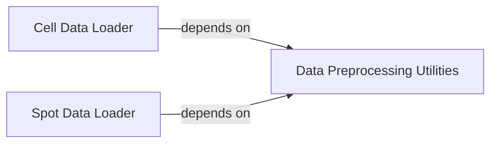

## Component Details

This subsystem is responsible for the robust and flexible handling of spatial transcriptomics data, encompassing both cell-specific and spot-specific modalities. It orchestrates the loading, comprehensive preprocessing, and efficient batching of data, including image features. Key functionalities include spatial upsampling, smoothing, normalization, balancing of sample indices, and the computation of neighbor contexts, all crucial for preparing data for downstream DeepSpot models.

### Cell Data Loader
This component is responsible for loading, preprocessing, and batching cell-specific spatial transcriptomics data and corresponding image features. It handles tasks such as spatial upsampling, smoothing, normalization, balancing indices, and computing cell neighbor contexts.

**Related Classes/Methods**:

- <a href="https://github.com/ratschlab/DeepSpot/blob/master/deepspot/cell/dataloader.py#L22-L208" target="_blank" rel="noopener noreferrer">`DeepSpot.deepspot.cell.dataloader.DeepCellDataLoader` (22:208)</a>
- <a href="https://github.com/ratschlab/DeepSpot/blob/master/deepspot/cell/dataloader.py#L23-L167" target="_blank" rel="noopener noreferrer">`DeepSpot.deepspot.cell.dataloader.DeepCellDataLoader:__init__` (23:167)</a>
- <a href="https://github.com/ratschlab/DeepSpot/blob/master/deepspot/cell/dataloader.py#L180-L208" target="_blank" rel="noopener noreferrer">`DeepSpot.deepspot.cell.dataloader.DeepCellDataLoader:__getitem__` (180:208)</a>
- <a href="https://github.com/ratschlab/DeepSpot/blob/master/deepspot/cell/dataloader.py#L173-L178" target="_blank" rel="noopener noreferrer">`DeepSpot.deepspot.cell.dataloader.DeepCellDataLoader:_load_patch` (173:178)</a>

### Spot Data Loader
This component is responsible for loading, preprocessing, and batching spot-specific spatial transcriptomics data and corresponding image features. It handles tasks such as spatial upsampling, smoothing, normalization, and computing spot neighbor contexts.

**Related Classes/Methods**:

- <a href="https://github.com/ratschlab/DeepSpot/blob/master/deepspot/spot/dataloader.py#L21-L186" target="_blank" rel="noopener noreferrer">`DeepSpot.deepspot.spot.dataloader.DeepSpotDataLoader` (21:186)</a>
- <a href="https://github.com/ratschlab/DeepSpot/blob/master/deepspot/spot/dataloader.py#L22-L118" target="_blank" rel="noopener noreferrer">`DeepSpot.deepspot.spot.dataloader.DeepSpotDataLoader:__init__` (22:118)</a>
- <a href="https://github.com/ratschlab/DeepSpot/blob/master/deepspot/spot/dataloader.py#L128-L186" target="_blank" rel="noopener noreferrer">`DeepSpot.deepspot.spot.dataloader.DeepSpotDataLoader:__getitem__` (128:186)</a>
- <a href="https://github.com/ratschlab/DeepSpot/blob/master/deepspot/spot/dataloader.py#L124-L126" target="_blank" rel="noopener noreferrer">`DeepSpot.deepspot.spot.dataloader.DeepSpotDataLoader:_load_patch` (124:126)</a>

### Data Preprocessing Utilities
This component provides a collection of utility functions used by both DeepCellDataLoader and DeepSpotDataLoader for common data loading and preprocessing tasks. These include functions for loading data, spatial upsampling and smoothing, adding zero padding, computing neighbors, getting balanced indices, and normalization.

**Related Classes/Methods**:

- <a href="https://github.com/ratschlab/DeepSpot/blob/master/deepspot/utils/utils_dataloader.py#L136-L178" target="_blank" rel="noopener noreferrer">`DeepSpot.deepspot.utils.utils_dataloader.load_data` (136:178)</a>
- <a href="https://github.com/ratschlab/DeepSpot/blob/master/deepspot/utils/utils_dataloader.py#L68-L101" target="_blank" rel="noopener noreferrer">`DeepSpot.deepspot.utils.utils_dataloader.spatial_upsample_and_smooth` (68:101)</a>
- <a href="https://github.com/ratschlab/DeepSpot/blob/master/deepspot/utils/utils_dataloader.py#L20-L26" target="_blank" rel="noopener noreferrer">`DeepSpot.deepspot.utils.utils_dataloader.get_balanced_index` (20:26)</a>
- <a href="https://github.com/ratschlab/DeepSpot/blob/master/deepspot/utils/utils_dataloader.py#L115-L124" target="_blank" rel="noopener noreferrer">`DeepSpot.deepspot.utils.utils_dataloader.compute_neighbors` (115:124)</a>
- <a href="https://github.com/ratschlab/DeepSpot/blob/master/deepspot/utils/utils_dataloader.py#L104-L112" target="_blank" rel="noopener noreferrer">`DeepSpot.deepspot.utils.utils_dataloader.add_zero_padding` (104:112)</a>
- <a href="https://github.com/ratschlab/DeepSpot/blob/master/deepspot/utils/utils_dataloader.py#L40-L65" target="_blank" rel="noopener noreferrer">`DeepSpot.deepspot.utils.utils_dataloader.run_aestetik` (40:65)</a>
- <a href="https://github.com/ratschlab/DeepSpot/blob/master/deepspot/utils/utils_dataloader.py#L29-L37" target="_blank" rel="noopener noreferrer">`DeepSpot.deepspot.utils.utils_dataloader.run_default` (29:37)</a>
- <a href="https://github.com/ratschlab/DeepSpot/blob/master/deepspot/utils/utils_dataloader.py#L127-L128" target="_blank" rel="noopener noreferrer">`DeepSpot.deepspot.utils.utils_dataloader.load_multiple_pickles` (127:128)</a>
- <a href="https://github.com/ratschlab/DeepSpot/blob/master/deepspot/utils/utils_dataloader.py#L131-L133" target="_blank" rel="noopener noreferrer">`DeepSpot.deepspot.utils.utils_dataloader.log1p_normalization` (131:133)</a>

### [FAQ](https://github.com/CodeBoarding/GeneratedOnBoardings/tree/main?tab=readme-ov-file#faq)