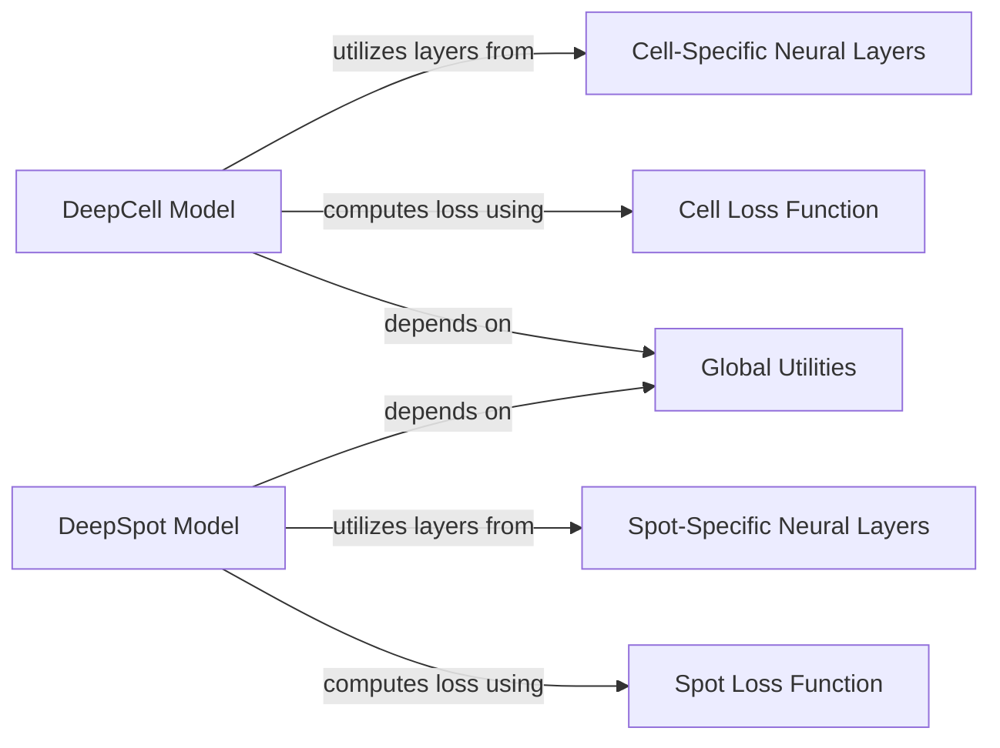

## Component Details

This graph illustrates the architecture of the DeepSpot Models subsystem, which encompasses the core neural network models for both cell and spot prediction (DeepCell and DeepSpot). It details their structural definitions, forward pass mechanisms for individual entities and their neighbors, and the management of training and validation lifecycles, including visualization of training progress. The system is modular, with dedicated components for cell-specific and spot-specific neural layers, and utilizes distinct loss functions for each model, all supported by global utility functions for consistency.

### DeepCell Model
Encapsulates the core logic for the DeepCell model, handling its initialization, training, validation, and forward pass operations for cell-related data. It orchestrates the use of specialized Phi and Rho layers and integrates with a loss function for optimization.

**Related Classes/Methods**:

- <a href="https://github.com/ratschlab/DeepSpot/blob/master/deepspot/cell/model.py#L63-L281" target="_blank" rel="noopener noreferrer">`deepspot.cell.model.DeepCell` (63:281)</a>
- <a href="https://github.com/ratschlab/DeepSpot/blob/master/deepspot/cell/model.py#L64-L128" target="_blank" rel="noopener noreferrer">`deepspot.cell.model.DeepCell:__init__` (64:128)</a>
- <a href="https://github.com/ratschlab/DeepSpot/blob/master/deepspot/cell/model.py#L144-L162" target="_blank" rel="noopener noreferrer">`deepspot.cell.model.DeepCell:loop_step` (144:162)</a>
- <a href="https://github.com/ratschlab/DeepSpot/blob/master/deepspot/cell/model.py#L164-L165" target="_blank" rel="noopener noreferrer">`deepspot.cell.model.DeepCell:training_step` (164:165)</a>
- <a href="https://github.com/ratschlab/DeepSpot/blob/master/deepspot/cell/model.py#L167-L168" target="_blank" rel="noopener noreferrer">`deepspot.cell.model.DeepCell:validation_step` (167:168)</a>
- <a href="https://github.com/ratschlab/DeepSpot/blob/master/deepspot/cell/model.py#L179-L181" target="_blank" rel="noopener noreferrer">`deepspot.cell.model.DeepCell:_forward_cell` (179:181)</a>
- <a href="https://github.com/ratschlab/DeepSpot/blob/master/deepspot/cell/model.py#L183-L188" target="_blank" rel="noopener noreferrer">`deepspot.cell.model.DeepCell:_forward_cell_neighbors` (183:188)</a>
- <a href="https://github.com/ratschlab/DeepSpot/blob/master/deepspot/cell/model.py#L235-L281" target="_blank" rel="noopener noreferrer">`deepspot.cell.model.DeepCell:plot_loss` (235:281)</a>
- <a href="https://github.com/ratschlab/DeepSpot/blob/master/deepspot/cell/model.py#L130-L135" target="_blank" rel="noopener noreferrer">`deepspot.cell.model.DeepCell._get_phi_multiplier` (130:135)</a>
- <a href="https://github.com/ratschlab/DeepSpot/blob/master/deepspot/cell/model.py#L137-L142" target="_blank" rel="noopener noreferrer">`deepspot.cell.model.DeepCell._get_forward_function` (137:142)</a>
- <a href="https://github.com/ratschlab/DeepSpot/blob/master/deepspot/cell/model.py#L190-L209" target="_blank" rel="noopener noreferrer">`deepspot.cell.model.DeepCell._apply_phi` (190:209)</a>
- <a href="https://github.com/ratschlab/DeepSpot/blob/master/deepspot/cell/model.py#L211-L214" target="_blank" rel="noopener noreferrer">`deepspot.cell.model.DeepCell._apply_rho` (211:214)</a>

### DeepSpot Model
Represents the central DeepSpot model, managing its lifecycle from initialization through training and validation, and executing forward passes for spot-related data. It leverages distinct Phi and Rho layers tailored for spot analysis and interacts with a shared loss function.

**Related Classes/Methods**:

- <a href="https://github.com/ratschlab/DeepSpot/blob/master/deepspot/spot/model.py#L58-L217" target="_blank" rel="noopener noreferrer">`deepspot.spot.model.DeepSpot` (58:217)</a>
- <a href="https://github.com/ratschlab/DeepSpot/blob/master/deepspot/spot/model.py#L59-L108" target="_blank" rel="noopener noreferrer">`deepspot.spot.model.DeepSpot:__init__` (59:108)</a>
- <a href="https://github.com/ratschlab/DeepSpot/blob/master/deepspot/spot/model.py#L128-L146" target="_blank" rel="noopener noreferrer">`deepspot.spot.model.DeepSpot:loop_step` (128:146)</a>
- <a href="https://github.com/ratschlab/DeepSpot/blob/master/deepspot/spot/model.py#L148-L149" target="_blank" rel="noopener noreferrer">`deepspot.spot.model.DeepSpot:training_step` (148:149)</a>
- <a href="https://github.com/ratschlab/DeepSpot/blob/master/deepspot/spot/model.py#L151-L152" target="_blank" rel="noopener noreferrer">`deepspot.spot.model.DeepSpot:validation_step` (151:152)</a>
- <a href="https://github.com/ratschlab/DeepSpot/blob/master/deepspot/spot/model.py#L163-L165" target="_blank" rel="noopener noreferrer">`deepspot.spot.model.DeepSpot:_forward_spot` (163:165)</a>
- <a href="https://github.com/ratschlab/DeepSpot/blob/master/deepspot/spot/model.py#L167-L172" target="_blank" rel="noopener noreferrer">`deepspot.spot.model.DeepSpot:_forward_spot_subspot` (167:172)</a>
- <a href="https://github.com/ratschlab/DeepSpot/blob/master/deepspot/spot/model.py#L174-L179" target="_blank" rel="noopener noreferrer">`deepspot.spot.model.DeepSpot:_forward_spot_neighbors` (174:179)</a>
- <a href="https://github.com/ratschlab/DeepSpot/blob/master/deepspot/spot/model.py#L181-L187" target="_blank" rel="noopener noreferrer">`deepspot.spot.model.DeepSpot:_forward_spot_subspot_neighbors` (181:187)</a>
- <a href="https://github.com/ratschlab/DeepSpot/blob/master/deepspot/spot/model.py#L110-L117" target="_blank" rel="noopener noreferrer">`deepspot.spot.model.DeepSpot._get_phi_multiplier` (110:117)</a>
- <a href="https://github.com/ratschlab/DeepSpot/blob/master/deepspot/spot/model.py#L119-L126" target="_blank" rel="noopener noreferrer">`deepspot.spot.model.DeepSpot._get_forward_function` (119:126)</a>
- <a href="https://github.com/ratschlab/DeepSpot/blob/master/deepspot/spot/model.py#L189-L208" target="_blank" rel="noopener noreferrer">`deepspot.spot.model.DeepSpot._apply_phi` (189:208)</a>
- <a href="https://github.com/ratschlab/DeepSpot/blob/master/deepspot/spot/model.py#L210-L213" target="_blank" rel="noopener noreferrer">`deepspot.spot.model.DeepSpot._apply_rho` (210:213)</a>

### Cell-Specific Neural Layers
Defines the specialized neural network layers, Phi and Rho, which are fundamental building blocks exclusively used within the DeepCell model for processing cell-specific features and interactions.

**Related Classes/Methods**:

- <a href="https://github.com/ratschlab/DeepSpot/blob/master/deepspot/cell/model.py#L36-L46" target="_blank" rel="noopener noreferrer">`deepspot.cell.model.Phi` (36:46)</a>
- <a href="https://github.com/ratschlab/DeepSpot/blob/master/deepspot/cell/model.py#L49-L60" target="_blank" rel="noopener noreferrer">`deepspot.cell.model.Rho` (49:60)</a>

### Spot-Specific Neural Layers
Provides the distinct Phi and Rho neural network layers, which are crucial for the DeepSpot model to effectively process and learn from spot-related data and their complex relationships.

**Related Classes/Methods**:

- <a href="https://github.com/ratschlab/DeepSpot/blob/master/deepspot/spot/model.py#L31-L41" target="_blank" rel="noopener noreferrer">`deepspot.spot.model.Phi` (31:41)</a>
- <a href="https://github.com/ratschlab/DeepSpot/blob/master/deepspot/spot/model.py#L44-L55" target="_blank" rel="noopener noreferrer">`deepspot.spot.model.Rho` (44:55)</a>

### Cell Loss Function
Provides the mean squared error (MSE) loss function specifically used by the DeepCell model to quantify prediction errors during training.

**Related Classes/Methods**:

- <a href="https://github.com/ratschlab/DeepSpot/blob/master/deepspot/cell/loss.py#L40-L42" target="_blank" rel="noopener noreferrer">`deepspot.cell.loss.loss_mse_function` (40:42)</a>

### Spot Loss Function
Provides the mean squared error (MSE) loss function specifically used by the DeepSpot model to quantify prediction errors during training.

**Related Classes/Methods**:

- <a href="https://github.com/ratschlab/DeepSpot/blob/master/deepspot/spot/loss.py#L19-L21" target="_blank" rel="noopener noreferrer">`deepspot.spot.loss.loss_mse_function` (19:21)</a>

### Global Utilities
Provides general utility functions, such as fix_seed, which are used across different parts of the DeepSpot system to ensure reproducibility and consistent behavior.

**Related Classes/Methods**:

- <a href="https://github.com/ratschlab/DeepSpot/blob/master/deepspot/utils/utils.py#L89-L100" target="_blank" rel="noopener noreferrer">`deepspot.utils.utils.fix_seed` (89:100)</a>

### [FAQ](https://github.com/CodeBoarding/GeneratedOnBoardings/tree/main?tab=readme-ov-file#faq)