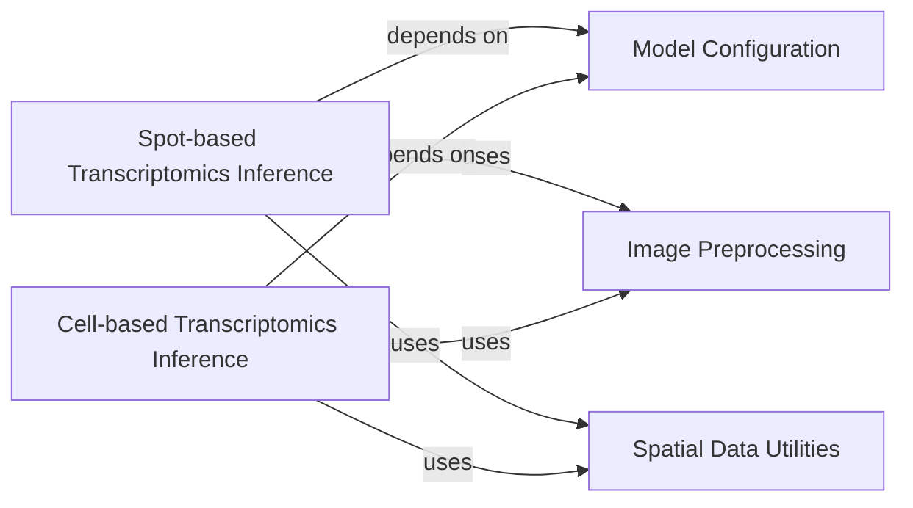

## Component Details

The Image Processing Module provides core functionalities for handling image data and integrating it with deep learning models to predict spatial transcriptomics. It encompasses model configuration, various image preprocessing steps like cropping and tiling, and the main inference pipelines for both spot-based and cell-based spatial transcriptomics predictions. The module relies on spatial data utilities to establish neighborhood relationships crucial for accurate predictions.

### Model Configuration
This component is responsible for initializing and configuring various deep learning models used for morphological feature extraction, along with their associated image preprocessing transformations. It supports different model architectures like Uni, Hoptimus, Phikon, Inception, ResNet, and DenseNet.

**Related Classes/Methods**:

- <a href="https://github.com/ratschlab/DeepSpot/blob/master/deepspot/utils/utils_image.py#L36-L177" target="_blank" rel="noopener noreferrer">`DeepSpot.deepspot.utils.utils_image:get_morphology_model_and_preprocess` (36:177)</a>
- `DeepSpot.deepspot.utils.utils_image.get_morphology_model_and_preprocess.MyModel` (full file reference)

### Image Preprocessing
This component provides utility functions for manipulating image data, including loading low-resolution images, cropping specific regions (tiles), dividing images into smaller mini-tiles, and converting/detaching PyTorch tensors for further processing.

**Related Classes/Methods**:

- <a href="https://github.com/ratschlab/DeepSpot/blob/master/deepspot/utils/utils_image.py#L180-L187" target="_blank" rel="noopener noreferrer">`DeepSpot.deepspot.utils.utils_image:get_low_res_image` (180:187)</a>
- <a href="https://github.com/ratschlab/DeepSpot/blob/master/deepspot/utils/utils_image.py#L190-L198" target="_blank" rel="noopener noreferrer">`DeepSpot.deepspot.utils.utils_image:crop_tile` (190:198)</a>
- <a href="https://github.com/ratschlab/DeepSpot/blob/master/deepspot/utils/utils_image.py#L201-L234" target="_blank" rel="noopener noreferrer">`DeepSpot.deepspot.utils.utils_image:compute_mini_tiles` (201:234)</a>
- <a href="https://github.com/ratschlab/DeepSpot/blob/master/deepspot/utils/utils_image.py#L237-L238" target="_blank" rel="noopener noreferrer">`DeepSpot.deepspot.utils.utils_image:detach_and_convert` (237:238)</a>

### Spot-based Transcriptomics Inference
This component handles the end-to-end process of predicting spatial transcriptomics counts for individual spots on an image. It integrates image processing, morphological feature extraction, and neighbor information to infer gene expression.

**Related Classes/Methods**:

- <a href="https://github.com/ratschlab/DeepSpot/blob/master/deepspot/utils/utils_image.py#L241-L292" target="_blank" rel="noopener noreferrer">`DeepSpot.deepspot.utils.utils_image:predict_spot_spatial_transcriptomics_from_image_path` (241:292)</a>

### Cell-based Transcriptomics Inference
This component manages the prediction of spatial transcriptomics counts for individual cells on an image. Similar to spot-based inference, it combines image processing, morphological feature extraction, and neighbor context to derive gene expression profiles.

**Related Classes/Methods**:

- <a href="https://github.com/ratschlab/DeepSpot/blob/master/deepspot/utils/utils_image.py#L295-L356" target="_blank" rel="noopener noreferrer">`DeepSpot.deepspot.utils.utils_image:predict_cell_spatial_transcriptomics_from_image_path` (295:356)</a>

### Spatial Data Utilities
This component provides functionalities related to spatial data, specifically for computing and managing neighborhood relationships between spots or cells based on their coordinates.

**Related Classes/Methods**:

- <a href="https://github.com/ratschlab/DeepSpot/blob/master/deepspot/utils/utils_dataloader.py#L115-L124" target="_blank" rel="noopener noreferrer">`DeepSpot.deepspot.utils.utils_dataloader:compute_neighbors` (115:124)</a>

### [FAQ](https://github.com/CodeBoarding/GeneratedOnBoardings/tree/main?tab=readme-ov-file#faq)