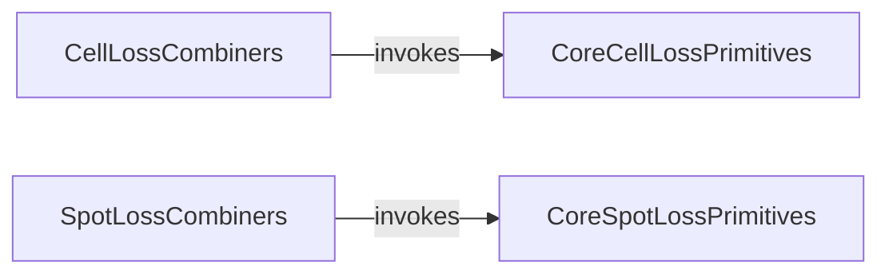

## Component Details

The 'Loss Functions' component in DeepSpot provides a comprehensive suite of loss functions for training both DeepCell and DeepSpot models. It is structured into primitive, atomic loss functions and combined loss functions, specifically tailored for cell and spot detection tasks. These functions leverage various metrics like Mean Squared Error (MSE), Pearson correlation, L1, Huber, and Cosine similarity to accurately evaluate model predictions against ground truth, enabling robust model optimization.

### CoreCellLossPrimitives
This component defines fundamental, atomic loss functions used within the cell loss calculations, including cosine similarity, Pearson correlation, mean squared error (MSE), L1 loss, Huber loss, and Poisson negative log-likelihood.

**Related Classes/Methods**:

- <a href="https://github.com/ratschlab/DeepSpot/blob/master/deepspot/cell/loss.py#L4-L6" target="_blank" rel="noopener noreferrer">`deepspot.cell.loss:loss_cosine_function` (4:6)</a>
- <a href="https://github.com/ratschlab/DeepSpot/blob/master/deepspot/cell/loss.py#L9-L37" target="_blank" rel="noopener noreferrer">`deepspot.cell.loss:loss_pearson_function` (9:37)</a>
- <a href="https://github.com/ratschlab/DeepSpot/blob/master/deepspot/cell/loss.py#L40-L42" target="_blank" rel="noopener noreferrer">`deepspot.cell.loss:loss_mse_function` (40:42)</a>
- <a href="https://github.com/ratschlab/DeepSpot/blob/master/deepspot/cell/loss.py#L45-L48" target="_blank" rel="noopener noreferrer">`deepspot.cell.loss:loss_l1_function` (45:48)</a>
- <a href="https://github.com/ratschlab/DeepSpot/blob/master/deepspot/cell/loss.py#L51-L63" target="_blank" rel="noopener noreferrer">`deepspot.cell.loss:loss_huber_function` (51:63)</a>
- <a href="https://github.com/ratschlab/DeepSpot/blob/master/deepspot/cell/loss.py#L66-L70" target="_blank" rel="noopener noreferrer">`deepspot.cell.loss:loss_poisson_function` (66:70)</a>

### CellLossCombiners
This component provides combined loss functions specifically designed for cell-related tasks in DeepSpot. These functions integrate fundamental loss primitives like MSE, Pearson, Cosine, L1, and Huber to create more complex loss metrics.

**Related Classes/Methods**:

- <a href="https://github.com/ratschlab/DeepSpot/blob/master/deepspot/cell/loss.py#L73-L77" target="_blank" rel="noopener noreferrer">`deepspot.cell.loss:loss_mse_pearson_function` (73:77)</a>
- <a href="https://github.com/ratschlab/DeepSpot/blob/master/deepspot/cell/loss.py#L80-L84" target="_blank" rel="noopener noreferrer">`deepspot.cell.loss:loss_mse_cosine_function` (80:84)</a>
- <a href="https://github.com/ratschlab/DeepSpot/blob/master/deepspot/cell/loss.py#L87-L91" target="_blank" rel="noopener noreferrer">`deepspot.cell.loss:loss_l1_cosine_function` (87:91)</a>
- <a href="https://github.com/ratschlab/DeepSpot/blob/master/deepspot/cell/loss.py#L94-L98" target="_blank" rel="noopener noreferrer">`deepspot.cell.loss:loss_huber_cosine_function` (94:98)</a>

### CoreSpotLossPrimitives
This component defines fundamental, atomic loss functions used within the spot loss calculations, including cosine similarity, Pearson correlation (implemented via centered cosine similarity), mean squared error (MSE), and Poisson negative log-likelihood.

**Related Classes/Methods**:

- <a href="https://github.com/ratschlab/DeepSpot/blob/master/deepspot/spot/loss.py#L4-L6" target="_blank" rel="noopener noreferrer">`deepspot.spot.loss:loss_cosine_function` (4:6)</a>
- <a href="https://github.com/ratschlab/DeepSpot/blob/master/deepspot/spot/loss.py#L9-L16" target="_blank" rel="noopener noreferrer">`deepspot.spot.loss:loss_pearson_function` (9:16)</a>
- <a href="https://github.com/ratschlab/DeepSpot/blob/master/deepspot/spot/loss.py#L19-L21" target="_blank" rel="noopener noreferrer">`deepspot.spot.loss:loss_mse_function` (19:21)</a>
- <a href="https://github.com/ratschlab/DeepSpot/blob/master/deepspot/spot/loss.py#L24-L28" target="_blank" rel="noopener noreferrer">`deepspot.spot.loss:loss_poisson_function` (24:28)</a>

### SpotLossCombiners
This component provides combined loss functions tailored for spot-related tasks in DeepSpot. These functions integrate fundamental loss primitives such as MSE, Pearson, and Cosine to form composite loss metrics.

**Related Classes/Methods**:

- <a href="https://github.com/ratschlab/DeepSpot/blob/master/deepspot/spot/loss.py#L31-L35" target="_blank" rel="noopener noreferrer">`deepspot.spot.loss:loss_mse_pearson_function` (31:35)</a>
- <a href="https://github.com/ratschlab/DeepSpot/blob/master/deepspot/spot/loss.py#L38-L42" target="_blank" rel="noopener noreferrer">`deepspot.spot.loss:loss_mse_cosine_function` (38:42)</a>

### [FAQ](https://github.com/CodeBoarding/GeneratedOnBoardings/tree/main?tab=readme-ov-file#faq)