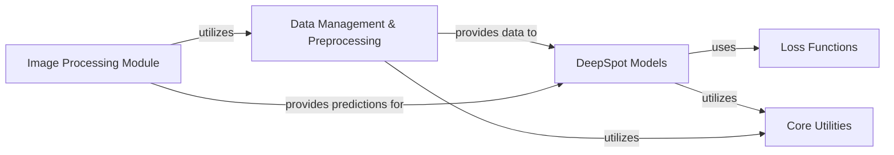

## Component Details

The DeepSpot project is designed for spatial transcriptomics analysis, focusing on both cell and spot level predictions from image data. The main flow involves loading and preprocessing spatial transcriptomics data and image features, feeding this data into specialized neural network models (DeepCell and DeepSpot), training these models using various loss functions, and finally, using the trained models to predict spatial transcriptomics from new image inputs. Utility modules support data handling, image processing, and general system functionalities.

### Data Management & Preprocessing
This component is responsible for loading, preprocessing, and batching both cell-specific and spot-specific spatial transcriptomics data and corresponding image features. It handles tasks such as spatial upsampling, smoothing, normalization, balancing indices, and computing neighbor contexts for the DeepSpot models.

**Related Classes/Methods**:

- <a href="https://github.com/ratschlab/DeepSpot/blob/master/deepspot/cell/dataloader.py#L22-L208" target="_blank" rel="noopener noreferrer">`DeepSpot.deepspot.cell.dataloader.DeepCellDataLoader` (22:208)</a>
- <a href="https://github.com/ratschlab/DeepSpot/blob/master/deepspot/cell/dataloader.py#L23-L167" target="_blank" rel="noopener noreferrer">`DeepSpot.deepspot.cell.dataloader.DeepCellDataLoader:__init__` (23:167)</a>
- <a href="https://github.com/ratschlab/DeepSpot/blob/master/deepspot/cell/dataloader.py#L180-L208" target="_blank" rel="noopener noreferrer">`DeepSpot.deepspot.cell.dataloader.DeepCellDataLoader:__getitem__` (180:208)</a>
- <a href="https://github.com/ratschlab/DeepSpot/blob/master/deepspot/cell/dataloader.py#L173-L178" target="_blank" rel="noopener noreferrer">`DeepSpot.deepspot.cell.dataloader.DeepCellDataLoader:_load_patch` (173:178)</a>
- <a href="https://github.com/ratschlab/DeepSpot/blob/master/deepspot/spot/dataloader.py#L21-L186" target="_blank" rel="noopener noreferrer">`DeepSpot.deepspot.spot.dataloader.DeepSpotDataLoader` (21:186)</a>
- <a href="https://github.com/ratschlab/DeepSpot/blob/master/deepspot/spot/dataloader.py#L22-L118" target="_blank" rel="noopener noreferrer">`DeepSpot.deepspot.spot.dataloader.DeepSpotDataLoader:__init__` (22:118)</a>
- <a href="https://github.com/ratschlab/DeepSpot/blob/master/deepspot/spot/dataloader.py#L128-L186" target="_blank" rel="noopener noreferrer">`DeepSpot.deepspot.spot.dataloader.DeepSpotDataLoader:__getitem__` (128:186)</a>
- <a href="https://github.com/ratschlab/DeepSpot/blob/master/deepspot/utils/utils_dataloader.py#L136-L178" target="_blank" rel="noopener noreferrer">`DeepSpot.deepspot.utils.utils_dataloader.load_data` (136:178)</a>
- <a href="https://github.com/ratschlab/DeepSpot/blob/master/deepspot/utils/utils_dataloader.py#L68-L101" target="_blank" rel="noopener noreferrer">`DeepSpot.deepspot.utils.utils_dataloader.spatial_upsample_and_smooth` (68:101)</a>
- <a href="https://github.com/ratschlab/DeepSpot/blob/master/deepspot/utils/utils_dataloader.py#L20-L26" target="_blank" rel="noopener noreferrer">`DeepSpot.deepspot.utils.utils_dataloader.get_balanced_index` (20:26)</a>
- <a href="https://github.com/ratschlab/DeepSpot/blob/master/deepspot/utils/utils_dataloader.py#L115-L124" target="_blank" rel="noopener noreferrer">`DeepSpot.deepspot.utils.utils_dataloader.compute_neighbors` (115:124)</a>
- <a href="https://github.com/ratschlab/DeepSpot/blob/master/deepspot/utils/utils_dataloader.py#L104-L112" target="_blank" rel="noopener noreferrer">`DeepSpot.deepspot.utils.utils_dataloader.add_zero_padding` (104:112)</a>
- <a href="https://github.com/ratschlab/DeepSpot/blob/master/deepspot/utils/utils_dataloader.py#L40-L65" target="_blank" rel="noopener noreferrer">`DeepSpot.deepspot.utils.utils_dataloader.run_aestetik` (40:65)</a>
- <a href="https://github.com/ratschlab/DeepSpot/blob/master/deepspot/utils/utils_dataloader.py#L29-L37" target="_blank" rel="noopener noreferrer">`DeepSpot.deepspot.utils.utils_dataloader.run_default` (29:37)</a>
- <a href="https://github.com/ratschlab/DeepSpot/blob/master/deepspot/utils/utils_dataloader.py#L127-L128" target="_blank" rel="noopener noreferrer">`DeepSpot.deepspot.utils.utils_dataloader.load_multiple_pickles` (127:128)</a>
- <a href="https://github.com/ratschlab/DeepSpot/blob/master/deepspot/utils/utils_dataloader.py#L131-L133" target="_blank" rel="noopener noreferrer">`DeepSpot.deepspot.utils.utils_dataloader.log1p_normalization` (131:133)</a>

### DeepSpot Models
This component encapsulates the core neural network architectures for both cell and spot prediction (DeepCell and DeepSpot models). It defines their structures, handles the forward passes for individual entities and their neighbors, and manages the training and validation lifecycles, including functionalities for visualizing training progress.

**Related Classes/Methods**:

- <a href="https://github.com/ratschlab/DeepSpot/blob/master/deepspot/cell/model.py#L63-L281" target="_blank" rel="noopener noreferrer">`DeepSpot.deepspot.cell.model.DeepCell` (63:281)</a>
- <a href="https://github.com/ratschlab/DeepSpot/blob/master/deepspot/cell/model.py#L64-L128" target="_blank" rel="noopener noreferrer">`DeepSpot.deepspot.cell.model.DeepCell:__init__` (64:128)</a>
- <a href="https://github.com/ratschlab/DeepSpot/blob/master/deepspot/cell/model.py#L144-L162" target="_blank" rel="noopener noreferrer">`DeepSpot.deepspot.cell.model.DeepCell:loop_step` (144:162)</a>
- <a href="https://github.com/ratschlab/DeepSpot/blob/master/deepspot/cell/model.py#L164-L165" target="_blank" rel="noopener noreferrer">`DeepSpot.deepspot.cell.model.DeepCell:training_step` (164:165)</a>
- <a href="https://github.com/ratschlab/DeepSpot/blob/master/deepspot/cell/model.py#L167-L168" target="_blank" rel="noopener noreferrer">`DeepSpot.deepspot.cell.model.DeepCell:validation_step` (167:168)</a>
- <a href="https://github.com/ratschlab/DeepSpot/blob/master/deepspot/cell/model.py#L179-L181" target="_blank" rel="noopener noreferrer">`DeepSpot.deepspot.cell.model.DeepCell:_forward_cell` (179:181)</a>
- <a href="https://github.com/ratschlab/DeepSpot/blob/master/deepspot/cell/model.py#L183-L188" target="_blank" rel="noopener noreferrer">`DeepSpot.deepspot.cell.model.DeepCell:_forward_cell_neighbors` (183:188)</a>
- <a href="https://github.com/ratschlab/DeepSpot/blob/master/deepspot/cell/model.py#L235-L281" target="_blank" rel="noopener noreferrer">`DeepSpot.deepspot.cell.model.DeepCell:plot_loss` (235:281)</a>
- <a href="https://github.com/ratschlab/DeepSpot/blob/master/deepspot/cell/model.py#L36-L46" target="_blank" rel="noopener noreferrer">`DeepSpot.deepspot.cell.model.Phi` (36:46)</a>
- <a href="https://github.com/ratschlab/DeepSpot/blob/master/deepspot/cell/model.py#L49-L60" target="_blank" rel="noopener noreferrer">`DeepSpot.deepspot.cell.model.Rho` (49:60)</a>
- <a href="https://github.com/ratschlab/DeepSpot/blob/master/deepspot/spot/model.py#L58-L217" target="_blank" rel="noopener noreferrer">`DeepSpot.deepspot.spot.model.DeepSpot` (58:217)</a>
- <a href="https://github.com/ratschlab/DeepSpot/blob/master/deepspot/spot/model.py#L59-L108" target="_blank" rel="noopener noreferrer">`DeepSpot.deepspot.spot.model.DeepSpot:__init__` (59:108)</a>
- <a href="https://github.com/ratschlab/DeepSpot/blob/master/deepspot/spot/model.py#L128-L146" target="_blank" rel="noopener noreferrer">`DeepSpot.deepspot.spot.model.DeepSpot:loop_step` (128:146)</a>
- <a href="https://github.com/ratschlab/DeepSpot/blob/master/deepspot/spot/model.py#L148-L149" target="_blank" rel="noopener noreferrer">`DeepSpot.deepspot.spot.model.DeepSpot:training_step` (148:149)</a>
- <a href="https://github.com/ratschlab/DeepSpot/blob/master/deepspot/spot/model.py#L151-L152" target="_blank" rel="noopener noreferrer">`DeepSpot.deepspot.spot.model.DeepSpot:validation_step` (151:152)</a>
- <a href="https://github.com/ratschlab/DeepSpot/blob/master/deepspot/spot/model.py#L163-L165" target="_blank" rel="noopener noreferrer">`DeepSpot.deepspot.spot.model.DeepSpot:_forward_spot` (163:165)</a>
- <a href="https://github.com/ratschlab/DeepSpot/blob/master/deepspot/spot/model.py#L167-L172" target="_blank" rel="noopener noreferrer">`DeepSpot.deepspot.spot.model.DeepSpot:_forward_spot_subspot` (167:172)</a>
- <a href="https://github.com/ratschlab/DeepSpot/blob/master/deepspot/spot/model.py#L174-L179" target="_blank" rel="noopener noreferrer">`DeepSpot.deepspot.spot.model.DeepSpot:_forward_spot_neighbors` (174:179)</a>
- <a href="https://github.com/ratschlab/DeepSpot/blob/master/deepspot/spot/model.py#L181-L187" target="_blank" rel="noopener noreferrer">`DeepSpot.deepspot.spot.model.DeepSpot:_forward_spot_subspot_neighbors` (181:187)</a>
- <a href="https://github.com/ratschlab/DeepSpot/blob/master/deepspot/spot/model.py#L31-L41" target="_blank" rel="noopener noreferrer">`DeepSpot.deepspot.spot.model.Phi` (31:41)</a>
- <a href="https://github.com/ratschlab/DeepSpot/blob/master/deepspot/spot/model.py#L44-L55" target="_blank" rel="noopener noreferrer">`DeepSpot.deepspot.spot.model.Rho` (44:55)</a>

### Loss Functions
This component provides a comprehensive suite of loss functions tailored for training both the DeepCell and DeepSpot models. These functions combine various metrics such as Mean Squared Error (MSE), Pearson correlation, L1, Huber, and Cosine similarity to accurately evaluate model predictions against ground truth.

**Related Classes/Methods**:

- <a href="https://github.com/ratschlab/DeepSpot/blob/master/deepspot/cell/loss.py#L73-L77" target="_blank" rel="noopener noreferrer">`DeepSpot.deepspot.cell.loss:loss_mse_pearson_function` (73:77)</a>
- <a href="https://github.com/ratschlab/DeepSpot/blob/master/deepspot/cell/loss.py#L80-L84" target="_blank" rel="noopener noreferrer">`DeepSpot.deepspot.cell.loss:loss_mse_cosine_function` (80:84)</a>
- <a href="https://github.com/ratschlab/DeepSpot/blob/master/deepspot/cell/loss.py#L87-L91" target="_blank" rel="noopener noreferrer">`DeepSpot.deepspot.cell.loss:loss_l1_cosine_function` (87:91)</a>
- <a href="https://github.com/ratschlab/DeepSpot/blob/master/deepspot/cell/loss.py#L94-L98" target="_blank" rel="noopener noreferrer">`DeepSpot.deepspot.cell.loss:loss_huber_cosine_function` (94:98)</a>
- <a href="https://github.com/ratschlab/DeepSpot/blob/master/deepspot/cell/loss.py#L4-L6" target="_blank" rel="noopener noreferrer">`DeepSpot.deepspot.cell.loss.loss_cosine_function` (4:6)</a>
- <a href="https://github.com/ratschlab/DeepSpot/blob/master/deepspot/cell/loss.py#L40-L42" target="_blank" rel="noopener noreferrer">`DeepSpot.deepspot.cell.loss.loss_mse_function` (40:42)</a>
- <a href="https://github.com/ratschlab/DeepSpot/blob/master/deepspot/cell/loss.py#L45-L48" target="_blank" rel="noopener noreferrer">`DeepSpot.deepspot.cell.loss.loss_l1_function` (45:48)</a>
- <a href="https://github.com/ratschlab/DeepSpot/blob/master/deepspot/cell/loss.py#L51-L63" target="_blank" rel="noopener noreferrer">`DeepSpot.deepspot.cell.loss.loss_huber_function` (51:63)</a>
- <a href="https://github.com/ratschlab/DeepSpot/blob/master/deepspot/spot/loss.py#L31-L35" target="_blank" rel="noopener noreferrer">`DeepSpot.deepspot.spot.loss:loss_mse_pearson_function` (31:35)</a>
- <a href="https://github.com/ratschlab/DeepSpot/blob/master/deepspot/spot/loss.py#L38-L42" target="_blank" rel="noopener noreferrer">`DeepSpot.deepspot.spot.loss:loss_mse_cosine_function` (38:42)</a>
- <a href="https://github.com/ratschlab/DeepSpot/blob/master/deepspot/spot/loss.py#L4-L6" target="_blank" rel="noopener noreferrer">`DeepSpot.deepspot.spot.loss.loss_cosine_function` (4:6)</a>
- <a href="https://github.com/ratschlab/DeepSpot/blob/master/deepspot/spot/loss.py#L19-L21" target="_blank" rel="noopener noreferrer">`DeepSpot.deepspot.spot.loss.loss_mse_function` (19:21)</a>

### Image Processing Module
This component provides utility functions specifically for image manipulation and processing, particularly for generating spatial transcriptomics predictions from raw image paths. It includes functionalities for obtaining morphology models, cropping and computing mini-tiles, and handling data format conversions necessary for model inference.

**Related Classes/Methods**:

- <a href="https://github.com/ratschlab/DeepSpot/blob/master/deepspot/utils/utils_image.py#L36-L177" target="_blank" rel="noopener noreferrer">`DeepSpot.deepspot.utils.utils_image:get_morphology_model_and_preprocess` (36:177)</a>
- <a href="https://github.com/ratschlab/DeepSpot/blob/master/deepspot/utils/utils_image.py#L241-L292" target="_blank" rel="noopener noreferrer">`DeepSpot.deepspot.utils.utils_image:predict_spot_spatial_transcriptomics_from_image_path` (241:292)</a>
- <a href="https://github.com/ratschlab/DeepSpot/blob/master/deepspot/utils/utils_image.py#L295-L356" target="_blank" rel="noopener noreferrer">`DeepSpot.deepspot.utils.utils_image:predict_cell_spatial_transcriptomics_from_image_path` (295:356)</a>
- `DeepSpot.deepspot.utils.utils_image.get_morphology_model_and_preprocess.MyModel` (full file reference)
- <a href="https://github.com/ratschlab/DeepSpot/blob/master/deepspot/utils/utils_image.py#L190-L198" target="_blank" rel="noopener noreferrer">`DeepSpot.deepspot.utils.utils_image.crop_tile` (190:198)</a>
- <a href="https://github.com/ratschlab/DeepSpot/blob/master/deepspot/utils/utils_image.py#L201-L234" target="_blank" rel="noopener noreferrer">`DeepSpot.deepspot.utils.utils_image.compute_mini_tiles` (201:234)</a>
- <a href="https://github.com/ratschlab/DeepSpot/blob/master/deepspot/utils/utils_image.py#L237-L238" target="_blank" rel="noopener noreferrer">`DeepSpot.deepspot.utils.utils_image.detach_and_convert` (237:238)</a>

### Core Utilities
This component contains general-purpose helper functions that are not specific to data loading or image processing. Its primary responsibility is to provide common helper functionalities, such as fixing random seeds for reproducibility across the entire system.

**Related Classes/Methods**:

- <a href="https://github.com/ratschlab/DeepSpot/blob/master/deepspot/utils/utils.py#L89-L100" target="_blank" rel="noopener noreferrer">`deepspot.utils.utils.fix_seed` (89:100)</a>

### [FAQ](https://github.com/CodeBoarding/GeneratedOnBoardings/tree/main?tab=readme-ov-file#faq)